# 𓂀 Darshil Samson 𓂀
  <!-- Subtle Typing Identity -->

---

## 🧠 ABOUT
Focused engineer-in-progress driven by systems thinking, fundamentals, and disciplined execution.
Prefer depth over noise. Build slow, build correct, build scalable.

---

## ⚙️ TECH STACK

<code>LANGUAGES</code>

<table>
<tr>
<td align="center" width="90"> <code>C</code></td>
<td align="center" width="90"> <code>PYTHON</code></td>
<td align="center" width="90"> <code>SQL</code></td>
</tr>
</table>

<code>FRONTEND</code>

<table>
<tr>
<td align="center" width="90"> <code>HTML5</code></td>
<td align="center" width="90"> <code>CSS3</code></td>
</tr>
</table>

<code>TOOLS &amp; PLATFORMS</code>

<table>
<tr>
<td align="center" width="90"> <code>GIT</code></td>
<td align="center" width="90"> <code>GitHub</code></td>
<td align="center" width="90"> <code>LINUX</code></td>
<td align="center" width="90"> <code>VS CODE</code></td>
</tr>
</table>

<code>CONCEPTS &amp; SYSTEMS</code>
  

---

## 🌐 SOCIAL PRESENCE

&nbsp;&nbsp;&nbsp;

&nbsp;&nbsp;&nbsp;

&nbsp;&nbsp;&nbsp;

