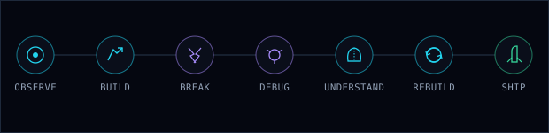
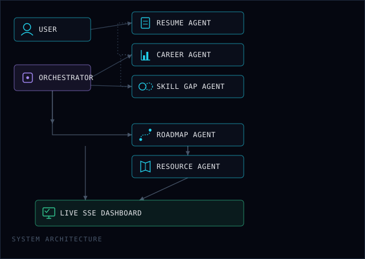

<!--
  Rendered by Guardian, with ChatGPT and Claude.
-->

<div align="center">



<sub>[`./identity`](#01-identity) &nbsp;·&nbsp; [`./engineering-dna`](#02-engineering-dna) &nbsp;·&nbsp; [`./featured-mission`](#03-featured-mission) &nbsp;·&nbsp; [`./archive`](#04-project-archive) &nbsp;·&nbsp; [`./telemetry`](#05-system-telemetry) &nbsp;·&nbsp; [`./connect`](#07-establish-connection)</sub>

</div>

<br />

## `01` IDENTITY

```
IDENTITY
────────────
AI/ML-focused student and builder interested in
intelligent systems, software engineering, and
turning ideas into working products.
```

BCA (AI/ML) at Jaipur National University · AI/ML Intern at DecodeLabs · India

<br />

## `02` ENGINEERING DNA



> I don't fear breaking things. I fear not understanding why they broke.
> Depth over speed, always.

<br />

## `03` FEATURED MISSION

```
MISSION // CAREER GUARDIAN AI
STATUS: OPERATIONAL
```

A multi-agent system that turns a resume into clarity, direction, and a focused roadmap — not just an ATS pass/fail check.

Five specialist agents, coordinated by an orchestrator, extract resume intelligence, detect career direction, surface skill gaps, and generate a 30/60/90-day roadmap. Its flagship output, the **Focus Score**, is a weighted composite that flags when a resume is targeting too many directions at once.



- Multi-agent architecture, not a single prompt wearing different hats
- Live SSE dashboard streaming per-agent progress
- Focus Score — quantified career-narrative alignment
- Secure by design: prompt-injection sanitiser, rate limiting, deep PDF validation, zero resume-content retention in logs
- Built for the Kaggle AI Agents Capstone; agents are ADK-compatible

`Python 3.11` · `FastAPI` · `Google Gemini` · `PyMuPDF` · `Pydantic v2` · `SSE`

[**› VIEW REPOSITORY**](https://github.com/Samdarshil/Career-Guardian-AI) &nbsp;|&nbsp; [**› DEMO VIDEO**](https://drive.google.com/file/d/1L3jCQxlwhwZHY0Akk1Zzt4Y0DYEO7fS9/view?usp=drivesdk)

<br />

## `04` PROJECT ARCHIVE

**01 // CAREER GUARDIAN AI** — flagship. See [`FEATURED MISSION`](#03-featured-mission) above.

**02 // DECODELABS INTERNSHIP PROJECTS**

<details>
<summary><code>&gt; expand archive</code></summary>
<br />

Four applied AI/ML and software-engineering builds, each self-contained with its own docs.

| | Project | What it does | Stack |
|---|---|---|---|
| 🤖 | **DecodeBot** | Rule-based terminal AI assistant with a cinematic interface | Python · colorama |
| 🧬 | **OncAI** | Full-stack breast cancer classifier — **96.5% accuracy** | FastAPI · React · scikit-learn · Docker |
| 🎯 | **Tech Stack Recommender** | Career-path recommender using TF-IDF + cosine similarity, built from scratch | Python · Flask |
| 📄 | **OCR Text Recognition** | Document text extraction with a preprocessing + confidence-filtering pipeline | OpenCV · Tesseract |

[**› VIEW FULL INTERNSHIP REPOSITORY**](https://github.com/Samdarshil/DecodeLabs-Internship-Projects)

</details>

**03 // VOID'S CALAMITY: THE UNSEEN HAND** — original cyberpunk game, in development. Repo not yet public.

<br />

## `05` SYSTEM TELEMETRY


**AI / ML**
[](#)
[](#)
[](#)

**Backend**
[](#)
[](#)

**Frontend**
[](#)
[](#)
[](#)
[](#)

**Computer Vision**
[](#)
[](#)

**DevOps & Tools**
[](#)
[](#)
[](#)
[](#)

**Foundations**
[](#)
[](#)

<br />

## `07` ESTABLISH CONNECTION

[](https://github.com/Samdarshil)
[](https://www.linkedin.com/in/darshil-samson-30a71a346)
[](https://leetcode.com/u/Samdarshil)
[](mailto:Samsondarshil@gmail.com)

<br />

<div align="center">

</div>
