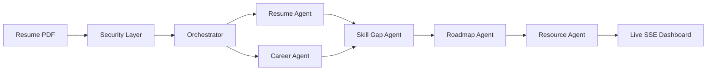

<!--
  Guardian's ledger: DARSHILVERSE — compiling.
  Built with Guardian, ChatGPT, and Claude.
  If you're reading this, you found the seam in the render.
-->

<div align="center">



<sub>[`./scan missions`](#01-mission-control) &nbsp;·&nbsp; [`./launch career-guardian-ai`](#02-featured-mission) &nbsp;·&nbsp; [`./open deep-space-archive`](#03-deep-space-archive) &nbsp;·&nbsp; [`./scan telemetry`](#05-system-telemetry) &nbsp;·&nbsp; [`./locate contact`](#08-establish-contact)</sub>

</div>

<br />

Focused engineer-in-progress driven by systems thinking, fundamentals, and disciplined execution. Prefer depth over noise — build slow, build correct, build scalable. Currently **BCA (AI/ML)** at Jaipur National University, and **AI/ML Intern** at DecodeLabs.

<br />

## `01` MISSION CONTROL



| Status | Mission | |
|:---|:---|:---|
| 🟢 `ACTIVE` | [**Career Guardian AI**](https://github.com/Samdarshil/Career-Guardian-AI) | Multi-agent career intelligence — flagship |
| 🟢 `ACTIVE` | [**DecodeLabs Internship Projects**](https://github.com/Samdarshil/DecodeLabs-Internship-Projects) | Four applied AI/ML + SWE builds |
| 🟡 `IN DEVELOPMENT` | **VOID's Calamity: The Unseen Hand** | Original cyberpunk game — repo not yet public |
| 🔵 `EARLY STAGE` | **D&A Digital Solutions** | Digital solutions venture — repo not yet public |
| 🔒 `CLASSIFIED` | **DARSHILVERSE** | Long-term vision — see [`UNKNOWN REGION`](#07-unknown-region) |

<br />

## `02` FEATURED MISSION

```
MISSION // CAREER GUARDIAN AI
SYSTEM STATUS  ████████████████████  ONLINE
```

**A multi-agent system that answers a sharper question than most resume tools ask.**

Most resume tools check: *"will an ATS pass this?"*
Career Guardian AI checks: *"does this resume tell one clear career story?"*

Five specialist agents — coordinated through a shared context object, not just parallel API calls — extract resume intelligence, detect career direction, surface skill gaps, and generate a 30/60/90-day roadmap. Its flagship output, the **Focus Score**, is a weighted composite (skill, project, cert, and experience alignment + consistency) that flags when a resume is targeting too many directions at once.



Built with a production-grade security layer — prompt-injection sanitiser, token-bucket rate limiter, deep PDF validation, and an audit logger that never stores resume content. Streams live per-agent progress over SSE. Developed for the Kaggle AI Agents Capstone; agents are ADK-compatible by design.

`Python 3.11` · `FastAPI` · `Google Gemini` · `PyMuPDF` · `Pydantic v2` · `SSE`

[**→ Repository**](https://github.com/Samdarshil/Career-Guardian-AI) &nbsp;|&nbsp; [**→ Demo video**](https://drive.google.com/file/d/1L3jCQxlwhwZHY0Akk1Zzt4Y0DYEO7fS9/view?usp=drivesdk)

<br />

## `03` DEEP SPACE ARCHIVE

<details>
<summary><code>&gt; ./open deep-space-archive</code></summary>
<br />

Four applied AI/ML and software-engineering builds from the DecodeLabs internship, each self-contained with its own docs.

| | Project | What it does | Stack |
|---|---|---|---|
| 🤖 | **DecodeBot** | Rule-based terminal AI assistant with a cinematic interface | Python · colorama |
| 🧬 | **OncAI** | Full-stack breast cancer classifier — **96.5% accuracy** | FastAPI · React · scikit-learn · Docker |
| 🎯 | **Tech Stack Recommender** | Career-path recommender using TF-IDF + cosine similarity, built from scratch | Python · Flask |
| 📄 | **OCR Text Recognition** | Document text extraction with a preprocessing + confidence-filtering pipeline | OpenCV · Tesseract |

[**→ Repository**](https://github.com/Samdarshil/DecodeLabs-Internship-Projects)

</details>

<br />

## `04` ENGINEERING DNA

```
        ┌──────────── OBSERVE ────────────┐
        ↓                                 ↑
      BUILD → BREAK → DEBUG → UNDERSTAND WHY
        ↓
      REBUILD
        ↓
       SHIP
```

I'd rather spend an extra hour understanding *why* something broke than patch around it. Most of what's above started as the smaller, uglier version of itself.

<br />

## `05` SYSTEM TELEMETRY



**AI / ML**
[](#)
[](#)
[](#)

**Backend**
[](#)
[](#)

**Frontend**
[](#)
[](#)
[](#)
[](#)

**Computer Vision**
[](#)
[](#)

**DevOps & Tools**
[](#)
[](#)
[](#)
[](#)

**Foundations**
[](#)
[](#)

<br />

## `06` SIGNALS INCOMING

- Full **Google ADK** runner integration for the agent stack
- Exposing agent pipelines as **MCP** tools
- Game systems & narrative architecture — an original project in development, not yet public

<br />

## `07` UNKNOWN REGION

```
OBJECT        DARSHILVERSE
STATUS        UNDER CONSTRUCTION
COORDINATES   UNKNOWN
```

I don't just want to use technology — I want to build systems, products, and experiences with it.

DARSHILVERSE is the long-term version of that: a command-center-style personal platform tying my projects, engineering journey, and an AI assistant together into one place. It doesn't exist yet. Destination not yet reached.

<details>
<summary><code>&gt; ./decode unknown-signal</code></summary>
<br />

<div align="center">


```
SOURCE: UNKNOWN
ORIGIN: CLASSIFIED
STATUS: UNRESOLVED

...GUARDIAN CALLSIGN DETECTED...
...COORDINATES POINT TOWARD DARSHILVERSE...
...FULL DECODE PENDING FUTURE TRANSMISSION...
```
</div>

</details>

<br />

## `08` ESTABLISH CONTACT

[](https://github.com/Samdarshil)
[](https://www.linkedin.com/in/darshil-samson-30a71a346)
[](https://leetcode.com/u/Samdarshil)
[](mailto:Samsondarshil@gmail.com)

<br />

<div align="center">

```
╔═══════════════════════════════════════╗
       END OF TRANSMISSION
       SPACE REMAINS UNEXPLORED.
╚═══════════════════════════════════════╝
```

**Still building. Still verifying. Still shipping.**

</div>
