 

# 𓂀       Darshil Samson       𓂀

---

## 🧠 ABOUT

Focused engineer-in-progress driven by systems thinking, strong fundamentals, and disciplined execution.

Prefer depth over noise.

**Build slowly. Build correctly. Build for impact.**

---

⚙️ TECH STACK

<code>LANGUAGES</code>

<table>
<tr>
<td align="center" width="90"> <code>C</code></td>
<td align="center" width="90"> <code>PYTHON</code></td>
<td align="center" width="90"> <code>SQL</code></td>
</tr>
</table>
<code>FRONTEND</code>

<table>
<tr>
<td align="center" width="90"> <code>HTML5</code></td>
<td align="center" width="90"> <code>CSS3</code></td>
</tr>
</table>
<code>TOOLS & PLATFORMS</code>

<table>
<tr>
<td align="center" width="90"> <code>GIT</code></td>
<td align="center" width="90"> <code>GITHUB</code></td>
<td align="center" width="90"> <code>LINUX</code></td>
<td align="center" width="90"> <code>VS CODE</code></td>
</tr>
</table>
<code>CONCEPTS & SYSTEMS</code>
  

🌐 SOCIAL PRESENCE

   

   

   

   

 

</td>
</tr>
</table>
  
</a>

